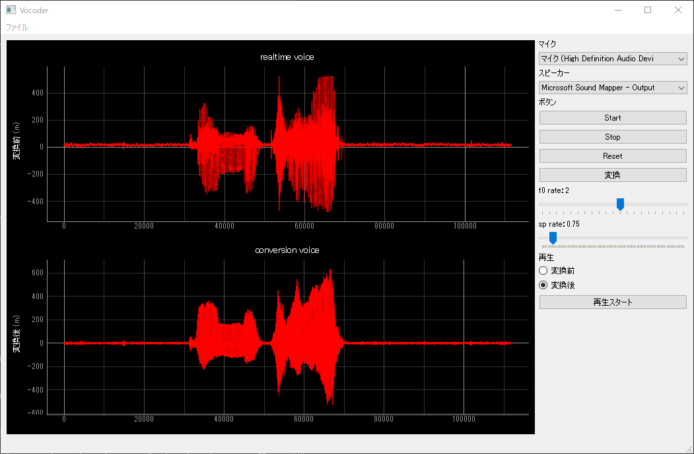

# Vocoder GUI APP
音声解析ライブラリ[WORLD](https://github.com/mmorise/World)のPythonのwrapperである[PyWorld](https://github.com/JeremyCCHsu/Python-Wrapper-for-World-Vocoder)を用いたアプリケーションである．
本アプリケーションはPyQt5とPyQtGraphを用いてGUIを作成し，アプリで録音した音声（またはすでにある音声データを読み込んだもの）を音声処理を行い音声合成するソフトウェアである．

## GUI

上の画像はvocoder_gui_appのGUIである．
左上の波形は本アプリで録音した波形をリアルタイムに表示し，左下の波形は録音した波形を声質変換した波形を表示する．
右側のウェジェットでそれぞれの処理を行う．

## コマンドプロンプト（Windows10）
- Python 3.7.3
- pip 20.3.1
### 環境作り
```bash
pip3 install virtualenv
virtualenv venv 
venv\Scripts\activate
# venv\Scripts\deactivate # 終了する場合
pip3 install --no-cache-dir -r requirements.txt
```

## Ubuntu 18.04LTS（WSL1）
- Python 3.6.9
- pip 9.0.1
- XServer
### 環境作り
```bash
apt install qtbase5-dev qttools5-dev-tools qt5-default
pip3 install virtualenv
virtualenv venv
source venv/bin/activate
# venv/bin/deactivate # 終了する場合
pip3 install --no-cache-dir -r requirements.txt
```

## 必要なパッケージ
```bash
numpy==1.16.4
pyaudio==0.2.11
pyworld==0.2.12
pyqtgraph==0.11.1
PyQt5==5.15.2
PyQt5-sip==12.8.1
```

## ※注意
### PyAudio
PyAudioはPython3.7の場合に別途インストールする必要がある．
- 参考
    - Python3.7でPyAudioがインストールできない時の解決法 | WATLAB -Python, 信号処理, AI-, https://watlab-blog.com/2019/05/21/pyaudio-install/, 参照:2021-01-15

## Use
### 起動
1. `python3 vocoder_gui_app.py`を実行

### 録音
1. マイク項目とスピーカー項目のコンボボックスから使用するマイクとスピーカーを選択
2. ボタン項目の"Start"ボタンをクリックすると録音開始される．また左下のステータスバーに"Start"と表示される
3. 音声が取れたら，"Stop"ボタンで録音を終了する．またステータスバーに"Stop"と表示される

### 再生
1. 再生項目でラジオボタンで再生する音声を選択する．
    - 変換前：録音または読み込んだ音声データを再生
    - 変換後：声質変換した音声データを再生
2. 再生が終わるとステータスバーに"Finish 変換前（後）の音声データ"と表示される
※ 再生が一度始まると途中で再生を止めることはできない

### 声質変換
1. "f0 rate"と"sp rate"を好みに値を変える．defalutはf0・sp rate共に1.0 1.0 である
    - f0 rate：ピッチ調整，2倍にすれば1オクターブ上に，0.5倍にすれば1オクターブ下になる
    - sp rate：声色調整，女性の声にする場合は1.0より小さく，男性はその逆で大きくする
2. "f0 rate"と"sp rate"を決定後，"変換"ボタンを押し，声質変換の処理が始まる
3. 声質変換の処理が終わると左下のステータスバーに"Finish conversion"と表示される

### リセット
1. "Reset"ボタンをクリックすると，録音した（読み込んだ）音声データと声質変換した音声データをアプリ内から削除する
2. リセットが終わるとステータスバーに"Reset"と表示される

### ファイル読み込み・書き込み
1. 左上のメニューバーにあるファイルバーをクリック
2. ファイルバーの内それぞれ読み込み・書き込みが可能

### 終了
1. 左上の✕マークをクリックまたは"Ctrl+Q"を同時押しでアプリは終了する

### ※注意
- ボタンを何度もクリックしないようにしてください<&br>
  録音の停止や変換する音声データの大きさによって処理に時間がかかる場合があります

## 参考
- mmisono/pyqt5-example: PyQt5 example, https://github.com/mmisono/pyqt5-example, 参照:2021-01-15
- Pythonのpyqtgraphを使う - Qiita, https://qiita.com/kai0706/items/612d21122bb15789144c, 参照2021-01-14
- pyqtgraph+PyAudioによるリアルタイムで音声プロット - たけし備忘録, https://takeshid.hatenadiary.jp/entry/2015/11/26/145634, 参照:2021-01-15
- Python 3.x - pyqtgraphにWavファイルの波形を表示したい。｜teratail, https://teratail.com/questions/279790, 参照:2021-01-15
- pyqtgraphにwidgetを追加し制御する - Qiita, pyqtgraphにwidgetを追加し制御する - Qiita, 参照:2021-01-15
- PythonのPyQtによるクロスプラットフォームGUIアプリ作成入門 - MyEnigma, https://myenigma.hatenablog.com/entry/2016/01/24/113413, 参照:2021-01-15
- python - PyQtGraphレイアウトにボタンを追加, https://stackoverrun.com/ja/q/12407043, 参照：2021-01-15
- 音声合成システム WORLD に触れてみる - Qiita, https://qiita.com/ohtaman/items/84426cee09c2ba4abc22, 参照:2021-01-15
- 2020年にPython GUIを作成する方法 PyQt5チュートリアル | Tech Branch, https://tech-branch.9999ch.com/archives/65, 参照:2021-01-15
- python - pyqt5でボタンを押せないようにしたい - スタック・オーバーフロー, https://ja.stackoverflow.com/questions/43255/pyqt5%E3%81%A7%E3%83%9C%E3%82%BF%E3%83%B3%E3%82%92%E6%8A%BC%E3%81%9B%E3%81%AA%E3%81%84%E3%82%88%E3%81%86%E3%81%AB%E3%81%97%E3%81%9F%E3%81%84, 参照:2021-01-15
- python - PyQtGraphを使用した日時オブジェクトのプロット, https://python5.com/q/hqwdvqnq, 参照:2021-01-18
- pyqt5 - 基本的なPyQtプログレスバー | pyqt5 Tutorial, https://riptutorial.com/ja/pyqt5/example/29500/%E5%9F%BA%E6%9C%AC%E7%9A%84%E3%81%AApyqt%E3%83%97%E3%83%AD%E3%82%B0%E3%83%AC%E3%82%B9%E3%83%90%E3%83%BC, 参照:2021-01-15
- python - Python3 PyQt5 setEnabled of a QAction causing crashes - Stack Overflow, https://stackoverflow.com/questions/45244807/python3-pyqt5-setenabled-of-a-qaction-causing-crashes, 参照：20210208
- PENGUINITIS - PyQt5 メモ, http://penguinitis.g1.xrea.com/computer/programming/Python/PyQt5/PyQt5-memo/PyQt5-memo.html, 参照：20210208
- PyQt5 チュートリアル - メニューバー | Delft スタック, https://www.delftstack.com/ja/tutorial/pyqt5/pyqt5-menubar/, 参照：20210208
- QSlider - Python Tutorial, https://pythonbasics.org/qslider/, 参照：20210208
- Python Examples of PyQt5.QtWidgets.QSlider, https://www.programcreek.com/python/example/82623/PyQt5.QtWidgets.QSlider, 参照：20210208
